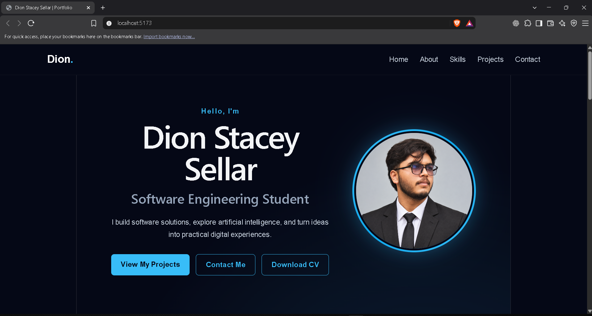
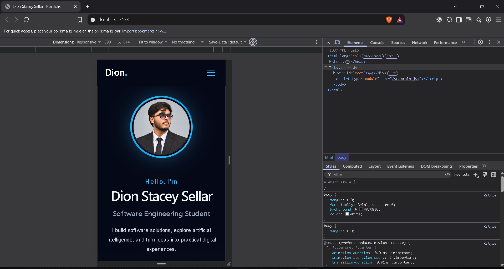

# Dion Stacey Sellar — Portfolio

A responsive portfolio showcasing my software development and AI projects. I am a Software Engineering student at NSBM Green University, studying for a BSc in Software Engineering (University of Plymouth).

**[View the portfolio](https://dion-portfolio-65zniy6fq-dionstacey03-9459.vercel.app)** · [GitHub profile](https://github.com/dionstacey03-dev) · [LinkedIn](https://www.linkedin.com/in/dion-stacey-sellar-1066a7339/)

## About this site

The site has sections for my background, skills, featured projects, and contact details. It includes responsive navigation and a downloadable CV.

**Stack:** React 19, JavaScript, CSS, and Vite 8. The project uses ESLint and is deployed on Vercel.

## Featured projects

| Project | Overview | Links |
| --- | --- | --- |
| **JARVIS AI Assistant** | A Python desktop assistant with voice interaction, speech recognition, text to speech, and AI responses using Ollama. | [GitHub](https://github.com/dionstacey03-dev/JARVIS-AI-Assistant) |
| **AI Smart Tourism Planner** | A Sri Lanka travel planning concept that considers destinations, weather, and travel conditions. | [Live demo](https://ai-smart-tourism-planner.vercel.app) · [GitHub](https://github.com/dionstacey03-dev/AI-Smart-Tourism-Planner) |

JARVIS is a desktop project, so its repository is the project link; no browser demo is listed.

## Skills

Python · JavaScript · React · SQL · Artificial Intelligence · Git & GitHub

## Run locally

Install [Node.js](https://nodejs.org/) and npm, then:

```bash
git clone https://github.com/dionstacey03-dev/Dion-Portfolio-.git
cd Dion-Portfolio-
npm install
npm run dev
```

Open the local URL printed by Vite. Other available commands:

```bash
npm run lint       # check the source with ESLint
npm run build      # create the production build in dist/
npm run preview    # serve the production build locally
```

## Deployment

The portfolio is deployed on Vercel. For a new deployment, import this GitHub repository into Vercel, select the **Vite** framework preset, use `npm run build` as the build command, and publish the `dist` output directory. Keep deployment visibility settings appropriate to your intended audience.

## Screenshots

Desktop preview from the latest source, running locally:



Mobile preview at a 390 px viewport:



## Contact

[Email](mailto:dion.stacey.03@gmail.com) · [LinkedIn](https://www.linkedin.com/in/dion-stacey-sellar-1066a7339/) · [GitHub](https://github.com/dionstacey03-dev)
